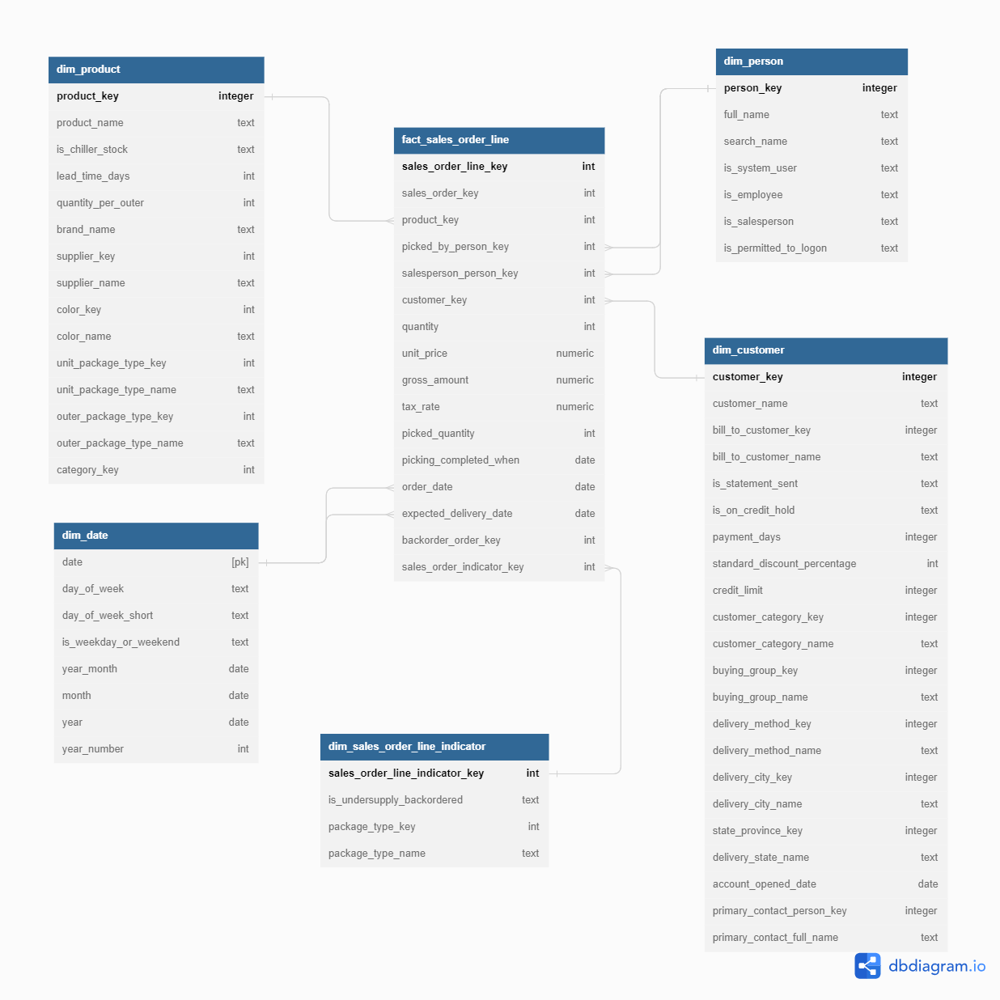

# Data Cleaning and Transformation
>
I will create necessary data model for doing analysis and use SQL to cleanse and tranform the data.
>
Tables that are necessary for analysis:
- dim_customer
- dim_product
- dim_person
- dim_date
- fact_sales_order_line
- fact_target_sales
# Data Modeling diagram


# Sales Overview Dashboard
The final result provides an overview of the sales performance from 2013 - 2016, including month-to-month tracking of targets and sales by salesman.
>
[Click here to open the dashboard](https://lookerstudio.google.com/embed/reporting/1de067c1-c5a2-4261-a03c-b75f3196ef4a/page/p_gwfh4sucbd)
>


# RFM Analysis

**Recency, Frequency and Monetary (RFM)** analysis is a technique to gain insights into customer spending patterns and effectively segment them, enable business to determine their target audience and devise tailored marketing campaigns.
- Recency: how recently a customer purchased a product, by subtracting the date of the latest order date from the date of the analysis. The more recently a customer has shopped, the more likely they are to keep your company in mind for future purchases.
- Frequency: total number of purchases - indicate how often a customer purchase to predict when they will comback or to remind customers of their needs.
- Monetary value: to calculate how much money they spend, that help company to identify customer who spend the most versus relatively small amounts.
>
Group the data by customer and calculate Recency, Frequency and Monetary metrics:
```sql
WITH fact_rfm__summary AS (
  SELECT 
    customer_key
    , MAX(order_date) AS last_active_date
    , DATE_DIFF('2016-06-1', MAX(order_date), DAY) AS recency --Since recency is calculated for a point in time and the dataset last order date is May 31 2016, we will set the 1 day after to calculate recency. 
    , COUNT (DISTINCT sales_order_key) AS frequency
    , SUM(gross_amount) AS monetary
  FROM `data-warehouse-course-391316`.`wide_world_importers_dwh`.`fact_sales_order_line`
  GROUP BY 1
)
```
RFM values will be scored and segmented by Percentiles. The score ranges from 1 to 5, where the higher this number, the better:
- The more recent the customer's purchase the higher the Recency (R) score.
- The more purchases the customer makes, the higher the Frequency score (F)
- The more the customer spends on purchases, the higher the score the customer will have Monetarity(M)
```sql
, fact_rfm__percentile AS (
  SELECT
    *
    , PERCENT_RANK() OVER (ORDER BY recency DESC) AS recency_rank --the closer active date, the higher rank for recency
    , PERCENT_RANK() OVER (ORDER BY frequency) AS frequency_rank
    , PERCENT_RANK() OVER (ORDER BY monetary) AS monetary_rank
  FROM fact_rfm__summary
)

, fact_frm__score AS (
  SELECT  *
    , CASE 
      WHEN recency_rank BETWEEN 0 AND 0.2 THEN 1
      WHEN recency_rank BETWEEN 0.2 AND 0.4 THEN 2
      WHEN recency_rank BETWEEN 0.4 AND 0.6 THEN 3
      WHEN recency_rank BETWEEN 0.6 AND 0.8 THEN 4
      WHEN recency_rank > 0.8 THEN 5
      ELSE 0
     END AS recency_score
    , CASE 
      WHEN frequency_rank BETWEEN 0 AND 0.2 THEN 1
      WHEN frequency_rank BETWEEN 0.2 AND 0.4 THEN 2
      WHEN frequency_rank BETWEEN 0.4 AND 0.6 THEN 3
      WHEN frequency_rank BETWEEN 0.6 AND 0.8 THEN 4
      WHEN frequency_rank > 0.8 THEN 5
      ELSE 0
     END AS frequency_score
    , CASE 
      WHEN monetary_rank BETWEEN 0 AND 0.2 THEN 1
      WHEN monetary_rank BETWEEN 0.2 AND 0.4 THEN 2
      WHEN monetary_rank BETWEEN 0.4 AND 0.6 THEN 3
      WHEN monetary_rank BETWEEN 0.6 AND 0.8 THEN 4
      WHEN monetary_rank > 0.8 THEN 5
      ELSE 0
      END AS monetary_score
  FROM fact_rfm__percentile
)
```
>
- Customers who are frequent buyers, have recently shopped and usually are spending a lot of money, they would get a score of 555: Recency (R) – 5, Frequency (F) – 5, Monetary (M) – 5. They are your best customers.
>
- On the other hand, customers who spend the least, do almost no buying at all and their last purchase was really long time ago, they will get a score of 111: Recency (R) – 1, Frequency (F) – 1, Monetary (M) – 1.
Grouping Customers into RFM segment and category
```sql
, fact_rfm__segment AS (
  SELECT *
    , CAST(CONCAT(recency_score, frequency_score, monetary_score) AS INT64) AS rfm_segment
  FROM fact_frm__score
)

  SELECT *
    , CASE
      WHEN rfm_segment IN (555, 554, 544, 545, 454, 455, 445) THEN "Champions"
      WHEN rfm_segment IN (543, 444, 435, 355, 354, 345, 344, 335) THEN "Loyal Customers"
      WHEN rfm_segment IN (553, 551, 552, 541, 542, 533, 532, 531, 452, 451, 442, 441, 431, 453, 433, 432, 423, 353, 352, 351, 342, 341, 333, 323) THEN "Potential Loyalist"
      WHEN rfm_segment IN (512, 511, 422, 421, 412, 411, 311) THEN "Recent Customers"
      WHEN rfm_segment IN (525, 524, 523, 522, 521, 515, 514, 513, 425, 424, 413,414, 415, 315, 314, 313) THEN "Promising"
      WHEN rfm_segment IN (535, 534, 443, 434, 343, 334, 325, 324) THEN "Customers Needing Attention"
      WHEN rfm_segment IN (331, 321, 312, 221, 213) THEN "About To Sleep"
      WHEN rfm_segment IN (255, 254, 245, 244, 253, 252, 243, 242, 235, 234, 225, 224, 153, 152, 145, 143, 142, 135, 134, 133, 125, 124) THEN "At Risk"
      WHEN rfm_segment IN (155, 154, 144, 214, 215,115, 114, 113) THEN "Can’t Lose Them"
      WHEN rfm_segment IN (332, 322, 231, 241, 251, 233, 232, 223, 222, 132, 123, 122, 212, 211) THEN "Hibernating"
      WHEN rfm_segment IN (111, 112, 121, 131, 141,151) THEN "Lost"
    ELSE 'Undefined'
    END AS rfm_category
  FROM fact_rfm__segment
```
**Table Result**


> 


